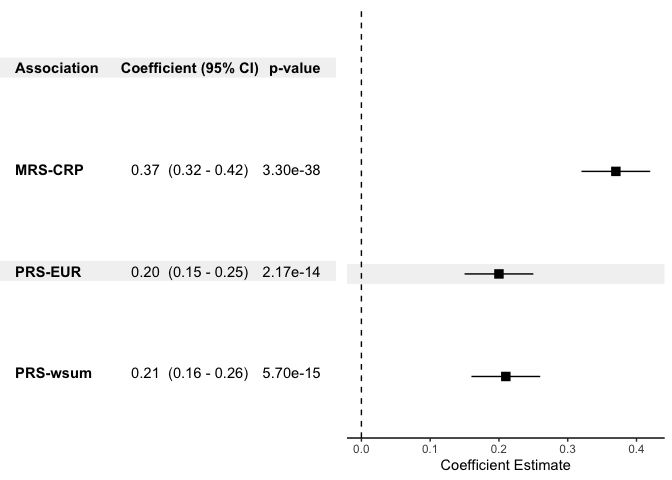
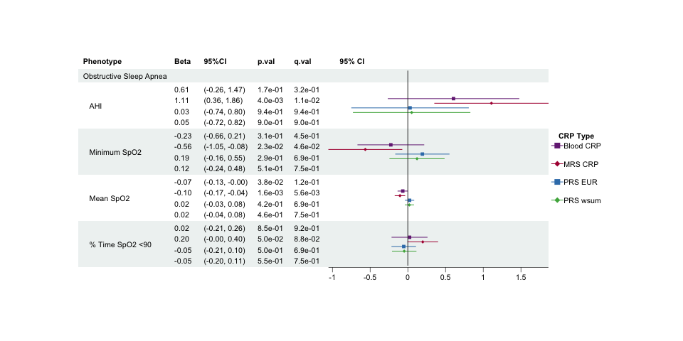
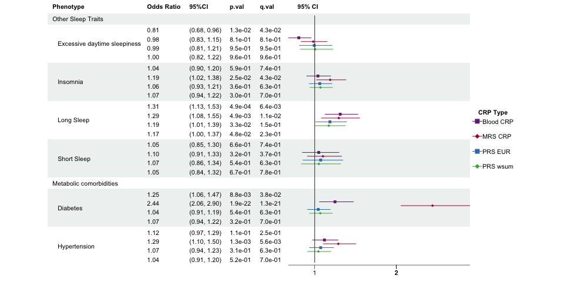
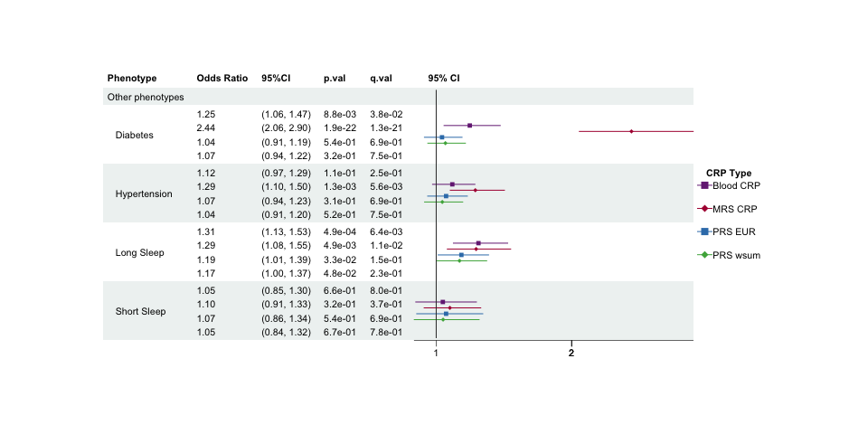

Create Figure 2 and 3
================
Leslie (ZW)
2024-05-13

# Create figure 2

``` r
# Read data
rmrs<-read.csv('~/OneDrive - Beth Israel Lahey Health/2023_methCRP/Results/Survey regression/20240513_crp_surveyPC.csv')
rprs<-read.csv('~/OneDrive - Beth Israel Lahey Health/2023_methCRP/Results/Survey regression/20240513_PRS_CRP.csv')
pl<-rbind(rmrs,rprs)

pl<-pl[order(pl$pheno),]
row.names(pl)<-1:nrow(pl)
pl$se <- (pl$upper - pl$lower) / (2 * qnorm(0.975))
names(pl) <- c('name','beta','pvalue','lower','upper','CRP_measures','se')
pl$group=c(rep('Comorbidities',12),rep('Other sleep traits',4),rep('Comorbidities',4),
           rep('NA',3),rep('Other sleep traits',8),rep('Obstructive sleep apnea',16),
           rep('Other sleep traits',8))

# Figure 2
data=pl[21:23,]
data$labels=paste0(data$pheno,' (',data$group,')')

fc <- data.frame(labels = data$CRP_measures, Beta= round(data$beta,2),
                 lower=round(data$lower,2),upper=round(data$upper,2),
                 p.value=c('3.30e-38','1.12e-12','1e-14'))

fc$labels<-as.factor(fc$labels)
fc<-fc[order(fc$labels),]
fc$colour<-c('white','gray95','white')

fctab <- as.data.frame(apply(fc,2,as.character))
fctab$ci<-paste0(fctab$Beta,'  (',fctab$lower, ' - ',fctab$upper,')')
fctab$colour<-c('white','gray95','white')
fctab <-rbind(fctab,data.frame(labels = "Association", Beta= "", lower = "", upper = "", 
                               p.value = "p-value",ci="Coefficient (95% CI)",colour='gray95'))
fctab$labels = fct_rev(relevel(as.factor(fctab$labels), "Association"))

mid<-ggplot(fc,aes(y = fct_rev(labels),x=Beta,xmin=lower,xmax=upper)) + theme_classic()  +
  geom_hline(aes(yintercept = labels, colour = colour), size = 7) +scale_colour_identity() +
   geom_point(aes(x=Beta), shape=15, size=3) + 
  geom_linerange(aes(xmin=lower, xmax=upper)) + geom_vline(xintercept = 0, linetype="dashed") +
  annotate("text", x = .1, y = 12, label = "CRP_blood",fontface='bold') +
  coord_cartesian(ylim=c(1,4)) +
  labs(x="Coefficient Estimate",y='') + theme(legend.position="none") +
  theme(axis.line.y = element_blank(), axis.ticks.y= element_blank(),
        axis.text.y= element_blank(), axis.title.y= element_blank())
```

    ## Warning: Using `size` aesthetic for lines was deprecated in ggplot2 3.4.0.
    ## ℹ Please use `linewidth` instead.
    ## This warning is displayed once every 8 hours.
    ## Call `lifecycle::last_lifecycle_warnings()` to see where this warning was
    ## generated.

``` r
tab<-ggplot(data = fctab, aes(y = labels)) +
  geom_hline(aes(yintercept = labels, colour = colour), size = 7) +
  geom_text(aes(x = 0, label = labels), hjust = 0, fontface = "bold") +
  geom_text(aes(x = 4, label = ci), fontface = ifelse(fctab$ci == "Coefficient (95% CI)", "bold", "plain")) +
  geom_text(aes(x = 7, label = p.value), hjust = 1,fontface = ifelse(fctab$p.value == "p-value", "bold", "plain")) +
  scale_colour_identity() +
  theme_void() +
  theme(plot.margin = margin(5, 0, 35, 0))

grid.arrange(tab,mid,ncol=2)
```

<!-- -->

# Create Figure 3

``` r
# Data preparation
rmrs<-read.csv('~/OneDrive - Beth Israel Lahey Health/2023_methCRP/Results/Survey regression/20240513_crp_surveyPC.csv')
rmrs$fdr <- 1
rmrs$fdr[1:14] <- p.adjust(rmrs[1:14,]$p.val,method='fdr')
rmrs$fdr[15:27] <- p.adjust(rmrs[15:27,]$p.val,method='fdr')
rmrs$pheno[c(8:9,21:22)] <- rep(c('cog_global', 'cog_change'), 2)

rprs<-read.csv('~/OneDrive - Beth Israel Lahey Health/2023_methCRP/Results/Survey regression/20240513_PRS_CRP.csv')
rprs$fdr <- 1
rprs$fdr[1:14] <- p.adjust(rprs[1:14,]$p.val,method='fdr')
rprs$fdr[15:28] <- p.adjust(rprs[15:28,]$p.val,method='fdr')
rprs$pheno[c(8:9,22:23)] <- rep(c('cog_global', 'cog_change'), 2)

pl <- rbind(rmrs,rprs)
pl <- pl[order(pl$pheno),]
row.names(pl) <- 1:nrow(pl)
Fig3A <- pl[c(32:47),]
Fig3B <- pl[c(1:8, 13:16, 48:55),]
Fig3C <- pl[c(9:12, 17:20, 24:31),]
Fig3C$coef <- exp(Fig3C$coef)
Fig3C$lower <- exp(Fig3C$lower)
Fig3C$upper <- exp(Fig3C$upper)
```

## Forest plot for Figure 3A

``` r
row.names(Fig3A) <- 1:nrow(Fig3A)
sub <- split(Fig3A, Fig3A$group) 
bl <- sub[[1]] %>% dplyr::select(-c(group))
names(bl) <- paste0('bl_', names(bl))
mrs <- sub[[2]] %>% dplyr::select(-c(group)) 
names(mrs) <- paste0('mrs_', names(mrs))
ss <- sub[[3]]%>% dplyr::select(-c(group)) 
names(ss) <- paste0('ss_', names(ss))
ws <- sub[[4]] %>% dplyr::select(-c(group))
names(ws) <- paste0('ws_', names(ws))
Fig3A <- cbind(bl, mrs, ss, ws) %>% dplyr::select(-c(mrs_pheno,ss_pheno,ws_pheno))
names(Fig3A)[1] <- 'Phenotype'

Fig3A <- rbind(Fig3A, data.frame(Phenotype=c('Obstructive Sleep Apnea'),
                              bl_coef=rep(NA,1), bl_p.val=rep(NA,1), bl_lower=rep(NA,1),
                              bl_upper=rep(NA,1), bl_fdr=rep(NA,1), mrs_coef=rep(NA,1), 
                              mrs_p.val=rep(NA,1), mrs_lower=rep(NA,1), mrs_upper=rep(NA,1), 
                              mrs_fdr=rep(NA,1), ss_coef=rep(NA,1), ss_p.val=rep(NA,1), 
                              ss_lower=rep(NA,1), ss_upper=rep(NA,1), ss_fdr=rep(NA,1), 
                              ws_coef=rep(NA,1), ws_p.val=rep(NA,1), ws_lower=rep(NA,1),
                              ws_upper=rep(NA,1), ws_fdr=rep(NA,1) ))

Fig3A <- Fig3A[c(5,1:4),]
row.names(Fig3A) <- 1:nrow(Fig3A)
Fig3A$Phenotype[c(2:5)]<-c('AHI','Minimum SpO2','Mean SpO2','% Time SpO2 <90')
Fig3A$Phenotype <- ifelse(is.na(Fig3A$bl_coef), 
                      Fig3A$Phenotype,
                      paste0("   ", Fig3A$Phenotype))
# NA to blank or NA will be transformed to carachter.
Fig3A$bl_coef <- round(Fig3A$bl_coef,3)
Fig3A$mrs_coef <- round(Fig3A$mrs_coef,3)
Fig3A$ss_coef <- round(Fig3A$ss_coef,3)
Fig3A$ws_coef <- round(Fig3A$ws_coef,3)
Fig3A$bl_fdr <- round(Fig3A$bl_fdr,3)
Fig3A$mrs_fdr <- round(Fig3A$mrs_fdr,3)
Fig3A$ss_fdr <- round(Fig3A$ss_fdr,3)
Fig3A$ws_fdr <- round(Fig3A$ws_fdr,3)
Fig3A$bl_p.val <- round(Fig3A$bl_p.val,3)
Fig3A$mrs_p.val <- round(Fig3A$mrs_p.val,3)
Fig3A$ss_p.val <- round(Fig3A$ss_p.val,3)
Fig3A$ws_p.val <- round(Fig3A$ws_p.val,3)

# Add two blank columns for CI
Fig3A$`95% CI` <- paste(rep(" ", 50), collapse = " ")
# Generate point estimation and 95% CI. Paste two CIs together and separate by line break.
Fig3A$bl_lower <- round(Fig3A$bl_lower,3)
Fig3A$mrs_lower <- round(Fig3A$mrs_lower,3)
Fig3A$ss_lower <- round(Fig3A$ss_lower,3)
Fig3A$ws_lower <- round(Fig3A$ws_lower,3)
Fig3A$bl_upper <- round(Fig3A$bl_upper,4)
Fig3A$mrs_upper <- round(Fig3A$mrs_upper,3)
Fig3A$ss_upper <- round(Fig3A$ss_upper,3)
Fig3A$ws_upper <- round(Fig3A$ws_upper,3)

Fig3A$CI <- paste(sprintf("(%.3f, %.3f)", Fig3A$bl_lower, Fig3A$bl_upper), 
                sprintf("(%.3f, %.3f)", Fig3A$mrs_lower, Fig3A$mrs_upper),
                sprintf("(%.3f, %.3f)", Fig3A$ss_lower, Fig3A$ss_upper),
                sprintf("(%.3f, %.3f)", Fig3A$ws_lower, Fig3A$ws_upper),
                sep = "\n")
Fig3A$Beta <- paste(sprintf("%.2f", Fig3A$bl_coef),
                sprintf("%.2f", Fig3A$mrs_coef),
                sprintf("%.2f", Fig3A$ss_coef),
                sprintf("%.2f", Fig3A$ws_coef),
                sep = "\n")
Fig3A$q.val <- paste(sprintf("%.2f", Fig3A$bl_fdr),
                sprintf("%.2f", Fig3A$mrs_fdr),
                sprintf("%.2f", Fig3A$ss_fdr),
                sprintf("%.2f", Fig3A$ws_fdr),
                sep = "\n")
Fig3A$p.val <- paste(sprintf("%.2f", Fig3A$bl_p.val),
                sprintf("%.2f", Fig3A$mrs_p.val),
                sprintf("%.2f", Fig3A$ss_p.val),
                sprintf("%.2f", Fig3A$ws_p.val),
                sep = "\n")
Fig3A$CI[grepl("NA", Fig3A$CI)] <- "" # Any NA to blank
Fig3A$Beta[grepl("NA", Fig3A$Beta)] <- "" # Any NA to blank
Fig3A$q.val[grepl("NA", Fig3A$q.val)] <- "" # Any NA to blank
Fig3A$p.val[grepl("NA", Fig3A$p.val)] <- "" # Any NA to blank

#################### plot
# Set-up theme
tm <- forest_theme(base_size = 8,
                   refline_lty = "solid",
                   ci_pch = c(15, 18),
                   ci_col = c("#762a83", "#AF0040","#377eb8","#4daf4a"),
                   footnote_gp = gpar(col = "blue"),
                   legend_name = "CRP Type",
                   legend_value = c("Blood CRP", "MRS CRP", "PRS ssum",  "PRS wsum" ),
                   vertline_lty = c("dashed", "dotted"),
                   vertline_col = c("#d6604d", "#bababa"),
                   # Table cell padding, width 4 and heights 3
                   )
# Generate plot
names(Fig3A)[23]<-'95%CI'
plot <- forest(Fig3A[,c(1,24,23,26,25,22)], 
            est = list(Fig3A$bl_coef,
                       Fig3A$mrs_coef,
                       Fig3A$ss_coef,
                       Fig3A$ws_coef),
            lower = list(Fig3A$bl_lower,
                       Fig3A$mrs_lower,
                         Fig3A$ss_lower,
                        Fig3A$ws_lower), 
            upper = list(Fig3A$bl_upper,
                      Fig3A$mrs_upper,
                         Fig3A$ss_upper,
                        Fig3A$ws_upper),
            ci_column = 6,
            ref_line = 0, # 1
            theme = tm)
plot
```

<!-- -->

## Forest plot for Figure 3B

``` r
row.names(Fig3B) <- 1:nrow(Fig3B)
sub <- split(Fig3B, Fig3B$group) 
bl <- sub[[1]] %>% dplyr::select(-c(group))
names(bl) <- paste0('bl_', names(bl))
mrs <- sub[[2]] %>% dplyr::select(-c(group)) 
names(mrs) <- paste0('mrs_', names(mrs))
ss <- sub[[3]]%>% dplyr::select(-c(group)) 
names(ss) <- paste0('ss_', names(ss))
ws <- sub[[4]] %>% dplyr::select(-c(group))
names(ws) <- paste0('ws_', names(ws))
Fig3B <- cbind(bl, mrs, ss, ws) %>% dplyr::select(-c(mrs_pheno,ss_pheno,ws_pheno))
names(Fig3B)[1] <- 'Phenotype'

Fig3B <- rbind(Fig3B, data.frame(Phenotype=c('Cognitive Function','Other Sleep Traits'),
                              bl_coef=rep(NA,2), bl_p.val=rep(NA,2), bl_lower=rep(NA,2),
                              bl_upper=rep(NA,2), bl_fdr=rep(NA,2), mrs_coef=rep(NA,2), 
                              mrs_p.val=rep(NA,2), mrs_lower=rep(NA,2), mrs_upper=rep(NA,2), 
                              mrs_fdr=rep(NA,2), ss_coef=rep(NA,2), ss_p.val=rep(NA,2), 
                              ss_lower=rep(NA,2), ss_upper=rep(NA,2), ss_fdr=rep(NA,2), 
                              ws_coef=rep(NA,2), ws_p.val=rep(NA,2), ws_lower=rep(NA,2),
                              ws_upper=rep(NA,2), ws_fdr=rep(NA,2) ))

Fig3B <- Fig3B[c(6,1:2, 7,3:5),]
row.names(Fig3B) <- 1:nrow(Fig3B)
Fig3B$Phenotype[c(2:3,6)]<-c('Change', 'Baseline', 'Sleep Duration')
Fig3B$Phenotype <- ifelse(is.na(Fig3B$bl_coef), 
                      Fig3B$Phenotype,
                      paste0("   ", Fig3B$Phenotype))
# NA to blank or NA will be transformed to carachter.
Fig3B$bl_coef <- round(Fig3B$bl_coef,3)
Fig3B$mrs_coef <- round(Fig3B$mrs_coef,3)
Fig3B$ss_coef <- round(Fig3B$ss_coef,3)
Fig3B$ws_coef <- round(Fig3B$ws_coef,3)
Fig3B$bl_fdr <- round(Fig3B$bl_fdr,3)
Fig3B$mrs_fdr <- round(Fig3B$mrs_fdr,3)
Fig3B$ss_fdr <- round(Fig3B$ss_fdr,3)
Fig3B$ws_fdr <- round(Fig3B$ws_fdr,3)
Fig3B$bl_p.val <- round(Fig3B$bl_p.val,3)
Fig3B$mrs_p.val <- round(Fig3B$mrs_p.val,3)
Fig3B$ss_p.val <- round(Fig3B$ss_p.val,3)
Fig3B$ws_p.val <- round(Fig3B$ws_p.val,3)

# Add two blank columns for CI
Fig3B$`95% CI` <- paste(rep(" ", 50), collapse = " ")
# Generate point estimation and 95% CI. Paste two CIs together and separate by line break.
Fig3B$bl_lower <- round(Fig3B$bl_lower,3)
Fig3B$mrs_lower <- round(Fig3B$mrs_lower,3)
Fig3B$ss_lower <- round(Fig3B$ss_lower,3)
Fig3B$ws_lower <- round(Fig3B$ws_lower,3)
Fig3B$bl_upper <- round(Fig3B$bl_upper,4)
Fig3B$mrs_upper <- round(Fig3B$mrs_upper,3)
Fig3B$ss_upper <- round(Fig3B$ss_upper,3)
Fig3B$ws_upper <- round(Fig3B$ws_upper,3)

Fig3B$CI <- paste(sprintf("(%.3f, %.3f)", Fig3B$bl_lower, Fig3B$bl_upper), 
                sprintf("(%.3f, %.3f)", Fig3B$mrs_lower, Fig3B$mrs_upper),
                sprintf("(%.3f, %.3f)", Fig3B$ss_lower, Fig3B$ss_upper),
                sprintf("(%.3f, %.3f)", Fig3B$ws_lower, Fig3B$ws_upper),
                sep = "\n")
Fig3B$Beta <- paste(sprintf("%.2f", Fig3B$bl_coef),
                sprintf("%.2f", Fig3B$mrs_coef),
                sprintf("%.2f", Fig3B$ss_coef),
                sprintf("%.2f", Fig3B$ws_coef),
                sep = "\n")
Fig3B$q.val <- paste(sprintf("%.2f", Fig3B$bl_fdr),
                sprintf("%.2f", Fig3B$mrs_fdr),
                sprintf("%.2f", Fig3B$ss_fdr),
                sprintf("%.2f", Fig3B$ws_fdr),
                sep = "\n")
Fig3B$p.val <- paste(sprintf("%.2f", Fig3B$bl_p.val),
                sprintf("%.2f", Fig3B$mrs_p.val),
                sprintf("%.2f", Fig3B$ss_p.val),
                sprintf("%.2f", Fig3B$ws_p.val),
                sep = "\n")
Fig3B$CI[grepl("NA", Fig3B$CI)] <- "" # Any NA to blank
Fig3B$Beta[grepl("NA", Fig3B$Beta)] <- "" # Any NA to blank
Fig3B$q.val[grepl("NA", Fig3B$q.val)] <- "" # Any NA to blank
Fig3B$p.val[grepl("NA", Fig3B$p.val)] <- "" # Any NA to blank

#################### plot
# Set-up theme
tm <- forest_theme(base_size = 8,
                   refline_lty = "solid",
                   ci_pch = c(15, 18),
                   ci_col = c("#762a83", "#AF0040","#377eb8","#4daf4a"),
                   footnote_gp = gpar(col = "blue"),
                   legend_name = "CRP Type",
                   legend_value = c("Blood CRP", "MRS CRP", "PRS ssum",  "PRS wsum" ),
                   vertline_lty = c("dashed", "dotted"),
                   vertline_col = c("#d6604d", "#bababa"),
                   # Table cell padding, width 4 and heights 3
                   )
# Generate plot
names(Fig3B)[23]<-'95%CI'
plot <- forest(Fig3B[,c(1,24,23,26,25,22)], 
            est = list(Fig3B$bl_coef,
                       Fig3B$mrs_coef,
                       Fig3B$ss_coef,
                       Fig3B$ws_coef),
            lower = list(Fig3B$bl_lower,
                       Fig3B$mrs_lower,
                         Fig3B$ss_lower,
                        Fig3B$ws_lower), 
            upper = list(Fig3B$bl_upper,
                      Fig3B$mrs_upper,
                         Fig3B$ss_upper,
                        Fig3B$ws_upper),
            ci_column = 6,
            ref_line = 0, # 1
            theme = tm)
plot
```

<!-- -->

## Forest plot for Figure 3C - Odds Ratio

``` r
row.names(Fig3C) <- 1:nrow(Fig3C)
sub <- split(Fig3C, Fig3C$group) 
bl <- sub[[1]] %>% dplyr::select(-c(group))
names(bl) <- paste0('bl_', names(bl))
mrs <- sub[[2]] %>% dplyr::select(-c(group))
names(mrs) <- paste0('mrs_', names(mrs))
ss <- sub[[3]] %>% dplyr::select(-c(group))
names(ss) <- paste0('ss_', names(ss))
ws <- sub[[4]] %>% dplyr::select(-c(group))
names(ws) <- paste0('ws_', names(ws))
Fig3C<-cbind(bl,mrs,ss,ws) %>% dplyr::select(-c(mrs_pheno,ss_pheno,ws_pheno))
names(Fig3C)[1]<-'Phenotype'

Fig3C <- rbind(Fig3C, data.frame(Phenotype=c('Other phenotypes'), bl_coef=rep(NA,1),
                              bl_p.val=rep(NA,1), bl_lower=rep(NA,1), bl_upper=rep(NA,1),
                              bl_fdr=rep(NA,1), mrs_coef=rep(NA,1), mrs_p.val=rep(NA,1),
                              mrs_lower=rep(NA,1), mrs_upper=rep(NA,1), mrs_fdr=rep(NA,1),
                              ss_coef=rep(NA,1), ss_p.val=rep(NA,1), ss_lower=rep(NA,1),
                              ss_upper=rep(NA,1), ss_fdr=rep(NA,1), ws_coef=rep(NA,1), 
                              ws_p.val=rep(NA,1),ws_lower=rep(NA,1),ws_upper=rep(NA,1), 
                              ws_fdr=rep(NA,1) ))
Fig3C <- Fig3C[c(5,1:4),]
row.names(Fig3C) <- 1:nrow(Fig3C)
Fig3C$Phenotype[c(2:5)] <- c('Diabetes', 'Hypertension', 'Long Sleep', 'Short Sleep')
Fig3C$Phenotype <- ifelse(is.na(Fig3C$bl_coef), 
                      Fig3C$Phenotype,
                      paste0("   ", Fig3C$Phenotype))

Fig3C$bl_coef <- round(Fig3C$bl_coef,3)
Fig3C$mrs_coef <- round(Fig3C$mrs_coef,3)
Fig3C$ss_coef <- round(Fig3C$ss_coef,3)
Fig3C$ws_coef <- round(Fig3C$ws_coef,3)
Fig3C$bl_p.val <- round(Fig3C$bl_p.val,3)
Fig3C$mrs_p.val <- round(Fig3C$mrs_p.val,3)
Fig3C$ss_p.val <- round(Fig3C$ss_p.val,3)
Fig3C$ws_p.val <- round(Fig3C$ws_p.val,3)

# Add two blank columns for CI
Fig3C$`95% CI` <- paste(rep(" ", 50), collapse = " ")
# Generate point estimation and 95% CI. Paste two CIs together and separate by line break.
Fig3C$bl_lower <- round(Fig3C$bl_lower,3)
Fig3C$mrs_lower <- round(Fig3C$mrs_lower,3)
Fig3C$ss_lower <- round(Fig3C$ss_lower,3)
Fig3C$ws_lower <- round(Fig3C$ws_lower,3)
Fig3C$bl_upper <- round(Fig3C$bl_upper,3)
Fig3C$mrs_upper <- round(Fig3C$mrs_upper,3)
Fig3C$ss_upper <- round(Fig3C$ss_upper,3)
Fig3C$ws_upper <- round(Fig3C$ws_upper,3)

Fig3C$CI <- paste(sprintf("(%.2f, %.2f)", Fig3C$bl_lower, Fig3C$bl_upper),
               sprintf("(%.2f, %.2f)", Fig3C$mrs_lower, Fig3C$mrs_upper),
                sprintf("(%.2f, %.2f)", Fig3C$ss_lower, Fig3C$ss_upper),
               sprintf("(%.2f, %.2f)", Fig3C$ws_lower, Fig3C$ws_upper),
                sep = "\n")
Fig3C$Beta <- paste(sprintf("%.2f", Fig3C$bl_coef),
                sprintf("%.2f", Fig3C$mrs_coef),
                sprintf("%.2f", Fig3C$ss_coef),
                sprintf("%.2f", Fig3C$ws_coef),
                sep = "\n")
Fig3C$q.val <- paste(sprintf("%.2f", Fig3C$bl_fdr),
                sprintf("%.2f", Fig3C$mrs_fdr),
                sprintf("%.2f", Fig3C$ss_fdr),
                sprintf("%.2f", Fig3C$ws_fdr),
                sep = "\n")
Fig3C$p.val <- paste(sprintf("%.3f", Fig3C$bl_p.val),
                sprintf("%.2f", Fig3C$mrs_p.val),
                sprintf("%.3f", Fig3C$ss_p.val),
                sprintf("%.2f", Fig3C$ws_p.val),
                sep = "\n")
Fig3C$CI[grepl("NA", Fig3C$CI)] <- "" # Any NA to blank
Fig3C$Beta[grepl("NA", Fig3C$Beta)] <- "" # Any NA to blank
Fig3C$q.val[grepl("NA", Fig3C$q.val)]<- ""
Fig3C$p.val[grepl("NA", Fig3C$p.val)]<- ""

#################### plot
# Set-up theme
tm <- forest_theme(base_size = 8,
                   refline_lty = "solid",
                   ci_pch = c(15, 18),
                   ci_col = c("#762a83", "#AF0040","#377eb8","#4daf4a"),
                   footnote_gp = gpar(col = "blue"),
                   legend_name = "CRP Type",
                   legend_value = c("Blood CRP", "MRS CRP", "PRS ssum",  "PRS wsum" ),
                   vertline_lty = c("dashed", "dotted"),
                   vertline_col = c("#d6604d", "#bababa"),
                   # Table cell padding, width 4 and heights 3
                   )
#> refline_lty will be deprecated, use refline_gp instead.
names(Fig3C)[23] <- '95%CI'
plot <- forest(Fig3C[,c(1,24,23,26,25,22)], #
            est = list(Fig3C$bl_coef,
                       Fig3C$mrs_coef,
                       Fig3C$ss_coef,
                       Fig3C$ws_coef),
            lower = list(Fig3C$bl_lower,
                       Fig3C$mrs_lower,
                         Fig3C$ss_lower,
                        Fig3C$ws_lower), 
            upper = list(Fig3C$bl_upper,
                      Fig3C$mrs_upper,
                         Fig3C$ss_upper,
                        Fig3C$ws_upper),
            ci_column = 6,
            ref_line = 1, 
            theme = tm)
plot
```

<!-- -->
