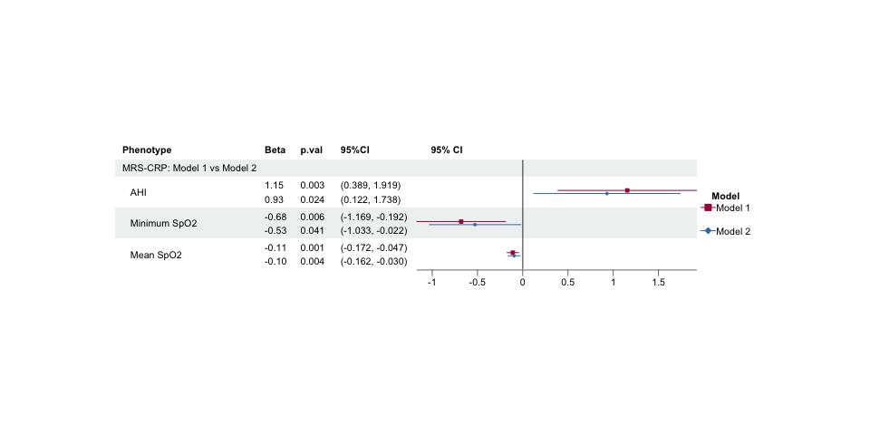
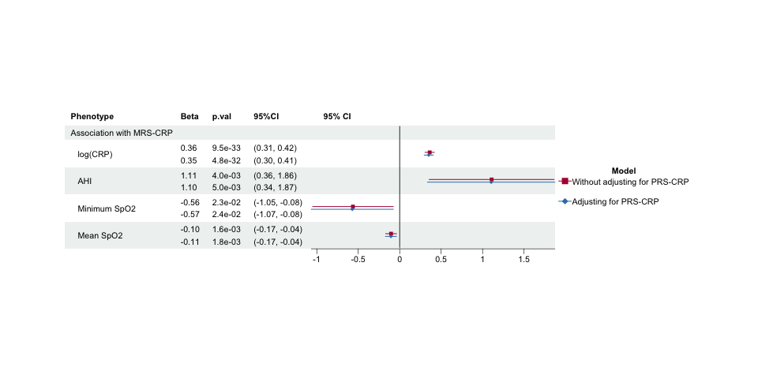

Supplementary Info Preparation
================
Leslie (ZW)
2024-05-13

# Create Supplementary Table S1

``` r
pheno_MESA <-read.csv('~/OneDrive - Beth Israel Lahey Health/2023_methCRP/Data/MESA_data/20240229_MESA_crp.csv')
pheno_MESA <- pheno_MESA[complete.cases(pheno_MESA$crp1),]

pheno_MESA$CRP_group <- as.factor(ifelse(pheno_MESA$crp1<1, 'Low (<1)', 
                                        ifelse(pheno_MESA$crp1>3, 'High (>3)', 'Borderline (1-3)')))
pheno_MESA$CRP_group <- relevel(pheno_MESA$CRP_group, ref = 'Low (<1)' )
pheno_MESA$overall<-'Overall'

# Set labels to show in table without changing column names
pheno_MESA$crp1 <- pheno_MESA$crp1 %>%
  ff_label("CRP (mg/L)") 
pheno_MESA$gender1 <- pheno_MESA$gender1 %>%
  ff_label("Gender (%)") 
pheno_MESA$age1c <- pheno_MESA$age1c %>%
  ff_label("Age") 
pheno_MESA$bmi1c <- pheno_MESA$bmi1c %>%
  ff_label("BMI") 
pheno_MESA$race1c <- factor(pheno_MESA$race1c,levels = c("1","2","3","4"),
                          labels = c("White", "Chinese", "Black", "Hispanic/Latino"))

Demo_var <- c("age1c", "bmi1c", "crp1", 'gender1', 'race1c')
Tab.S1 <- pheno_MESA %>% 
  summary_factorlist("CRP_group", Demo_var, na_include=FALSE,cont = "mean") %>%
  ff_percent_only() 
```

    ## Warning: Unknown columns: `p`

``` r
# Keep only 1 level for variables with 2 levels
keep <- c(1:4,6:9) 
Tab.S1 <- Tab.S1[keep,]
Tab.S1.overall <- pheno_MESA %>% summary_factorlist('overall', Demo_var, na_include=FALSE, cont = "mean") %>%
  ff_percent_only()
```

    ## Warning: Unknown columns: `p`

``` r
Tab.S1.overall <- Tab.S1.overall[keep,]
Tab.S1 <- merge(Tab.S1, Tab.S1.overall, by=c('label','levels'))
# Rearrange the table
Tab.S1 <- Tab.S1[c(4:8,1:3), c(1,2,6,3:5)]
Tab.S1$levels[4] <- 'Female'
Tab.S1$label[5] <- ''
Tab.S1$Variable <- NA
Tab.S1$Variable[c(1:3)] <- paste0(Tab.S1$label[c(1:3)], ' (', Tab.S1$levels[c(1:3)], ')')
Tab.S1$Variable[4] <- paste0(Tab.S1$label[4], ' - ', Tab.S1$levels[4])
Tab.S1$Variable[5:8] <- Tab.S1$levels[5:8]
Tab.S1 <- Tab.S1[,c(7,3:6)]
group_name <- data.frame(Variable='Race (%)', Overall=rep(NA,1), Low=rep(NA,1), 
                                    Borderline=rep(NA,1), High=rep(NA,1) )
names(group_name)[3:5] <- names(Tab.S1)[3:5]
Tab.S1 <- rbind(Tab.S1, group_name)
Tab.S1 <- Tab.S1[c(1:4,9,5:8),]
Tab.S1[is.na(Tab.S1)] <- ''
kable(Tab.S1, row.names = FALSE)
```

| Variable               | Overall     | Low (\<1)   | Borderline (1-3) | High (\>3) |
|:-----------------------|:------------|:------------|:-----------------|:-----------|
| Age (Mean (SD))        | 62.2 (10.2) | 61.5 (10.7) | 62.9 (10.2)      | 62.3 (9.8) |
| BMI (Mean (SD))        | 28.3 (5.5)  | 25.6 (4.2)  | 28.0 (4.6)       | 30.8 (6.0) |
| CRP (mg/L) (Mean (SD)) | 3.8 (5.9)   | 0.6 (0.2)   | 1.8 (0.6)        | 8.3 (8.0)  |
| Gender (%) - Female    | 52.4        | 42.0        | 48.0             | 65.1       |
| Race (%)               |             |             |                  |            |
| White                  | 39.3        | 41.2        | 39.9             | 37.1       |
| Black                  | 26.0        | 20.2        | 24.6             | 32.3       |
| Chinese                | 12.1        | 22.2        | 11.5             | 4.2        |
| Hispanic/Latino        | 22.6        | 16.3        | 24.0             | 26.4       |

``` r
#write.csv(Tab.S1, '~/OneDrive - Beth Israel Lahey Health/2023_methCRP/Draft/Tables and Figures/Table_S1.csv', row.names = FALSE)
```

# Create Figure S1

## Data Preparation

``` r
rmrs1 <- read.csv('~/OneDrive - Beth Israel Lahey Health/2023_methCRP/Results/Survey regression/20240513_crp_surveyPC.csv')
m1.num <- subset(rmrs1, pheno%in%c('SLPA54','SLPA91','SLPA92') & group%in%'MRS_CRP')
m1.cat <- subset(rmrs1, pheno%in%c('DIABETES2_INDICATOR','HYPERTENSION','LongSlp') 
           & group%in%'MRS_CRP')
m1.crp <- subset(rmrs1, pheno%in%c('LongSlp') & group%in%'Blood_CRP')
m1.num$mod<-'1'
m1.cat$mod<-'1'
m1.crp$mod<-'1'

rmrs2 <- read.csv('~/OneDrive - Beth Israel Lahey Health/2023_methCRP/Results/Survey regression/20240514_MRSCRP_mod2.csv')
m2.num <- subset(rmrs2, pheno%in%c('SLPA54','SLPA91','SLPA92') & group%in%'MRS_CRP')
m2.cat <- subset(rmrs2, pheno%in%c('DIABETES2_INDICATOR','HYPERTENSION','LongSlp') 
           & group%in%'MRS_CRP')
m2.crp <- subset(rmrs2, pheno%in%c('LongSlp')  & group%in%'Blood_CRP')
m2.num$mod <- '2'
m2.cat$mod <- '2'
m2.crp$mod <- '2'

FigS1A <- rbind(m1.num, m2.num)
FigS1B <- rbind(m1.cat, m2.cat)
FigS1C <- rbind(m1.crp, m2.crp)

FigS1B$coef<-exp(FigS1B$coef)
FigS1B$lower<-exp(FigS1B$lower)
FigS1B$upper<-exp(FigS1B$upper)
FigS1C$coef<-exp(FigS1C$coef)
FigS1C$lower<-exp(FigS1C$lower)
FigS1C$upper<-exp(FigS1C$upper)
```

## Fig S1A

``` r
row.names(FigS1A) <- 1:nrow(FigS1A)
sub <- split(FigS1A, FigS1A$mod) 
m1 <- sub[[1]] %>% dplyr::select(-c(group,mod))
names(m1)<-paste0('m1_', names(m1))
m2 <- sub[[2]]%>% dplyr::select(-c(group,mod)) 
names(m2) <- paste0('m2_',names(m2))

FigS1A <- cbind(m1, m2) %>% dplyr::select(-c(m2_pheno))
names(FigS1A)[1] <- 'Phenotype'

FigS1A <- rbind(FigS1A,data.frame(Phenotype=c('MRS-CRP: Model 1 vs Model 2'),
                           m1_coef=rep(NA,1), m1_p.val=rep(NA,1), m1_lower=rep(NA,1), m1_upper=rep(NA,1),
                           m2_coef=rep(NA,1), m2_p.val=rep(NA,1), m2_lower=rep(NA,1), m2_upper=rep(NA,1)))
FigS1A <- FigS1A[c(4,1:3),]
row.names(FigS1A) <- 1:nrow(FigS1A)
FigS1A$Phenotype[c(2:4)] <- c('AHI','Minimum SpO2','Mean SpO2')
FigS1A$Phenotype <- ifelse(is.na(FigS1A$m1_coef), 
                      FigS1A$Phenotype,
                      paste0("   ", FigS1A$Phenotype))
# NA to blank or NA will be transformed to carachter.
FigS1A$m1_coef<-round(FigS1A$m1_coef,3)
FigS1A$m2_coef<-round(FigS1A$m2_coef,3)
FigS1A$m1_p.val<-round(FigS1A$m1_p.val,3)
FigS1A$m2_p.val<-round(FigS1A$m2_p.val,3)

# Add two blank columns for CI
FigS1A$`95% CI` <- paste(rep(" ", 50), collapse = " ")
# Generate point estimation and 95% CI. Paste two CIs together and separate by line break.
FigS1A$m1_lower <- round(FigS1A$m1_lower,3)
FigS1A$m2_lower <- round(FigS1A$m2_lower,3)
FigS1A$m1_upper <- round(FigS1A$m1_upper,4)
FigS1A$m2_upper <- round(FigS1A$m2_upper,3)

FigS1A$CI <- paste(sprintf("(%.3f, %.3f)", FigS1A$m1_lower, FigS1A$m1_upper), 
                sprintf("(%.3f, %.3f)", FigS1A$m2_lower, FigS1A$m2_upper), 
                sep = "\n")
FigS1A$Beta <- paste(sprintf("%.2f", FigS1A$m1_coef),
                sprintf("%.2f", FigS1A$m2_coef),
                sep = "\n")
FigS1A$p.val <- paste(sprintf("%.3f", FigS1A$m1_p.val),
                sprintf("%.3f", FigS1A$m2_p.val),
                sep = "\n")
FigS1A$CI[grepl("NA", FigS1A$CI)] <- "" # Any NA to blank
FigS1A$Beta[grepl("NA", FigS1A$Beta)] <- "" # Any NA to blank
FigS1A$p.val[grepl("NA", FigS1A$p.val)] <- "" # Any NA to blank

#################### plot
# Set-up theme
tm <- forest_theme(base_size = 8,
                   refline_lty = "solid",
                   ci_pch = c(15, 18),
                   ci_col = c( "#AF0040","#377eb8"),
                   footnote_gp = gpar(col = "blue"),
                   legend_name = "Model",
                   legend_value = c("Model 1", "Model 2" ),
                   vertline_lty = c("dashed", "dotted"),
                   vertline_col = c("#d6604d", "#bababa"),
                   # Table cell padding, width 4 and heights 3
                   )
#> refline_lty will be deprecated, use refline_gp instead.
names(FigS1A)[11]<-'95%CI'
plot <- forest(FigS1A[,c(1,12,13,11,10)], 
            est = list(FigS1A$m1_coef,
                       FigS1A$m2_coef),
            lower = list(FigS1A$m1_lower,
                         FigS1A$m2_lower),
            upper = list(FigS1A$m1_upper,
                         FigS1A$m2_upper),
            ci_column = 5,
            ref_line = 0, 
            theme = tm)
plot
```

<!-- -->

## Fig S1B

``` r
row.names(FigS1B) <- 1:nrow(FigS1B)
sub <- split(FigS1B, FigS1B$mod) 
m1 <- sub[[1]] %>% dplyr::select(-c(group,mod))
names(m1) <- paste0('m1_', names(m1))
m2 <- sub[[2]]%>% dplyr::select(-c(group,mod))
names(m2) <- paste0('m2_', names(m2))
FigS1B <- cbind(m1,m2) %>% dplyr::select(-c(m2_pheno))
names(FigS1B)[1] <- 'Phenotype'

FigS1B <- rbind(FigS1B, data.frame(Phenotype=c('MRS-CRP: Model 1 vs Model 2'),
                           m1_coef=rep(NA,1),m1_p.val=rep(NA,1), m1_lower=rep(NA,1),m1_upper=rep(NA,1),
                           m2_coef=rep(NA,1), m2_p.val=rep(NA,1),m2_lower=rep(NA,1),m2_upper=rep(NA,1) ))
FigS1B <- FigS1B[c(4,1:3),]
row.names(FigS1B) <- 1:nrow(FigS1B)
FigS1B$Phenotype[c(2,3,4)] <- c('Diabetes', 'Hypertension', 'Long Sleep')
FigS1B$Phenotype <- ifelse(is.na(FigS1B$m1_coef), 
                      FigS1B$Phenotype,
                      paste0("   ", FigS1B$Phenotype))
# NA to blank or NA will be transformed to carachter.
FigS1B$m1_coef<-round(FigS1B$m1_coef,3)
FigS1B$m2_coef<-round(FigS1B$m2_coef,3)
FigS1B$m1_p.val<-round(FigS1B$m1_p.val,3)
FigS1B$m2_p.val<-round(FigS1B$m2_p.val,3)

# Add two m1ank columns for CI
FigS1B$`95% CI` <- paste(rep(" ", 50), collapse = " ")
# Generate point estimation and 95% CI. Paste two CIs together and separate by line break.
FigS1B$m1_lower <- round(FigS1B$m1_lower,3)
FigS1B$m2_lower <- round(FigS1B$m2_lower,3)
FigS1B$m1_upper <- round(FigS1B$m1_upper,3)
FigS1B$m2_upper <- round(FigS1B$m2_upper,3)

FigS1B$CI <- paste(sprintf("(%.3f, %.3f)", FigS1B$m1_lower, FigS1B$m1_upper),
                sprintf("(%.3f, %.3f)", FigS1B$m2_lower, FigS1B$m2_upper),
                sep = "\n")
FigS1B$Beta <- paste(sprintf("%.2f", FigS1B$m1_coef),
                sprintf("%.2f", FigS1B$m2_coef),
                sep = "\n")
FigS1B$p.val <- paste(sprintf("%.3f", FigS1B$m1_p.val),
                sprintf("%.3f", FigS1B$m2_p.val),
                sep = "\n")

FigS1B$CI[grepl("NA", FigS1B$CI)] <- "" # Any NA to blank
FigS1B$Beta[grepl("NA", FigS1B$Beta)] <- "" # Any NA to blank
FigS1B$p.val[grepl("NA", FigS1B$p.val)]<- ""

#################### plot
names(FigS1B)[11] <- '95%CI'
plot <- forest(FigS1B[,c(1,12,13,11,10)], 
            est = list(FigS1B$m1_coef,
                       FigS1B$m2_coef),
            lower = list(FigS1B$m1_lower,
                         FigS1B$m2_lower),
            upper = list(FigS1B$m1_upper,
                         FigS1B$m2_upper),
            ci_column = 5,
            ref_line = 1, 
            theme = tm)
plot
```

<!-- -->

## Fig S1C

``` r
row.names(FigS1C) <- 1:nrow(FigS1C)
sub <- split(FigS1C, FigS1C$mod) 
m1 <- sub[[1]] %>% dplyr::select(-c(group,mod))
names(m1) <- paste0('m1_', names(m1))
m2 <- sub[[2]]%>% dplyr::select(-c(group,mod))
names(m2) <- paste0('m2_', names(m2))
FigS1C <- cbind(m1,m2) %>% dplyr::select(-c(m2_pheno))
names(FigS1C)[1] <- 'Phenotype'

FigS1C <- rbind(FigS1C, data.frame(Phenotype=c('Blood-CRP: Model 1 vs Model 2'),
                           m1_coef=rep(NA,1),m1_p.val=rep(NA,1), m1_lower=rep(NA,1),m1_upper=rep(NA,1),
                           m2_coef=rep(NA,1), m2_p.val=rep(NA,1),m2_lower=rep(NA,1),m2_upper=rep(NA,1) ))
FigS1C <- FigS1C[c(2,1),]
row.names(FigS1C) <- 1:nrow(FigS1C)
FigS1C$Phenotype[c(2)] <- c('Long Sleep')
FigS1C$Phenotype <- ifelse(is.na(FigS1C$m1_coef), 
                      FigS1C$Phenotype,
                      paste0("   ", FigS1C$Phenotype))
# NA to blank or NA will be transformed to carachter.
FigS1C$m1_coef<-round(FigS1C$m1_coef,3)
FigS1C$m2_coef<-round(FigS1C$m2_coef,3)
FigS1C$m1_p.val<-round(FigS1C$m1_p.val,3)
FigS1C$m2_p.val<-round(FigS1C$m2_p.val,3)

# Add two m1ank columns for CI
FigS1C$`95% CI` <- paste(rep(" ", 50), collapse = " ")
# Generate point estimation and 95% CI. Paste two CIs together and separate by line break.
FigS1C$m1_lower <- round(FigS1C$m1_lower,3)
FigS1C$m2_lower <- round(FigS1C$m2_lower,3)
FigS1C$m1_upper <- round(FigS1C$m1_upper,3)
FigS1C$m2_upper <- round(FigS1C$m2_upper,3)

FigS1C$CI <- paste(sprintf("(%.3f, %.3f)", FigS1C$m1_lower, FigS1C$m1_upper),
                sprintf("(%.3f, %.3f)", FigS1C$m2_lower, FigS1C$m2_upper),
                sep = "\n")
FigS1C$Beta <- paste(sprintf("%.2f", FigS1C$m1_coef),
                sprintf("%.2f", FigS1C$m2_coef),
                sep = "\n")
FigS1C$p.val <- paste(sprintf("%.3f", FigS1C$m1_p.val),
                sprintf("%.3f", FigS1C$m2_p.val),
                sep = "\n")

FigS1C$CI[grepl("NA", FigS1C$CI)] <- "" # Any NA to blank
FigS1C$Beta[grepl("NA", FigS1C$Beta)] <- "" # Any NA to blank
FigS1C$p.val[grepl("NA", FigS1C$p.val)]<- ""

#################### plot
names(FigS1C)[11] <- '95%CI'
plot <- forest(FigS1C[,c(1,12,13,11,10)], 
            est = list(FigS1C$m1_coef,
                       FigS1C$m2_coef),
            lower = list(FigS1C$m1_lower,
                         FigS1C$m2_lower),
            upper = list(FigS1C$m1_upper,
                         FigS1C$m2_upper),
            ci_column = 5,
            ref_line = 1, 
            theme = tm)
plot
```

<!-- -->

# Create Figure S2

## Fig S2A

``` r
womrs <- read.csv('~/OneDrive - Beth Israel Lahey Health/2023_methCRP/Results/Survey regression/20240517_slp_dis_wo.csv')

# Figure S2A
pnum <- womrs
pnum <- pnum[order(pnum$pheno),]
row.names(pnum)<-1:nrow(pnum)

sub <- split(pnum,pnum$condition) 
bas <- sub[[1]] %>% dplyr::select(-c(condition)) # baseline
names(bas) <- paste0('bas_', names(bas))
cha <- sub[[2]] %>% dplyr::select(-c(condition)) # change
names(cha) <- paste0('cha_', names(cha))
dia<-sub[[3]] %>% dplyr::select(-c(condition)) # diab
names(dia) <- paste0('dia_', names(dia))
hyp<-sub[[4]] %>% dplyr::select(-c(condition)) # hyp
names(hyp) <- paste0('hyp_', names(hyp))
pnum<-cbind(bas, cha, dia, hyp) %>% dplyr::select(-c(cha_pheno, dia_pheno, hyp_pheno))
names(pnum)[1] <- 'Phenotype'

pnum <- rbind(pnum,data.frame(Phenotype=c('Without adjusting for MRS_CRP'),
                           bas_coef=rep(NA,1), bas_p.val=rep(NA,1), bas_lower=rep(NA,1), 
                           bas_upper=rep(NA,1), cha_coef=rep(NA,1), cha_p.val=rep(NA,1),
                           cha_lower=rep(NA,1), cha_upper=rep(NA,1), dia_coef=rep(NA,1), 
                           dia_p.val=rep(NA,1), dia_lower=rep(NA,1), dia_upper=rep(NA,1),
                           hyp_coef=rep(NA,1), hyp_p.val=rep(NA,1), hyp_lower=rep(NA,1),
                           hyp_upper=rep(NA,1)))
pnum <- pnum[c(4,1:3),]
row.names(pnum) <- 1:nrow(pnum)
pnum$Phenotype[c(2:4)] <- c('AHI','Minimum SpO2','Mean SpO2')

pnum$Phenotype <- ifelse(is.na(pnum$bas_coef), 
                      pnum$Phenotype,
                      paste0("   ", pnum$Phenotype))
# NA to blank or NA will be transformed to carachter.
pnum$bas_coef <- round(pnum$bas_coef,3)
pnum$cha_coef <- round(pnum$cha_coef,3)
pnum$hyp_coef <- round(pnum$hyp_coef,3)
pnum$dia_coef <- round(pnum$dia_coef,3)
pnum$bas_p.val <- round(pnum$bas_p.val,3)
pnum$cha_p.val <- round(pnum$cha_p.val,3)
pnum$hyp_p.val <- round(pnum$hyp_p.val,3)
pnum$dia_p.val <- round(pnum$dia_p.val,3)

# Add two basank columns for CI
pnum$`95% CI` <- paste(rep(" ", 50), collapse = " ")
# Generate point estimation and 95% CI. Paste two CIs together and separate by line break.
pnum$bas_lower <- round(pnum$bas_lower,3)
pnum$cha_lower <- round(pnum$cha_lower,3)
pnum$hyp_lower <- round(pnum$hyp_lower,3)
pnum$dia_lower <- round(pnum$dia_lower,3)
pnum$bas_upper <- round(pnum$bas_upper,4)
pnum$cha_upper <- round(pnum$cha_upper,3)
pnum$hyp_upper <- round(pnum$hyp_upper,3)
pnum$dia_upper <- round(pnum$dia_upper,3)

pnum$CI <- paste(sprintf("(%.3f, %.3f)", pnum$bas_lower, pnum$bas_upper), 
                sprintf("(%.3f, %.3f)", pnum$cha_lower, pnum$cha_upper),
                sprintf("(%.3f, %.3f)", pnum$dia_lower, pnum$dia_upper),
                sprintf("(%.3f, %.3f)", pnum$hyp_lower, pnum$hyp_upper),
                sep = "\n")
pnum$Beta <- paste(sprintf("%.2f", pnum$bas_coef),
                sprintf("%.2f", pnum$cha_coef),
                sprintf("%.2f", pnum$dia_coef),
                sprintf("%.2f", pnum$hyp_coef),
                sep = "\n")
pnum$p.val <- paste(sprintf("%.2f", pnum$bas_p.val),
                sprintf("%.2f", pnum$cha_p.val),
                sprintf("%.2f", pnum$dia_p.val),
                sprintf("%.2f", pnum$hyp_p.val),
                sep = "\n")
pnum$CI[grepl("NA", pnum$CI)] <- "" # Any NA to blank
pnum$Beta[grepl("NA", pnum$Beta)] <- "" # Any NA to blank
pnum$p.val[grepl("NA", pnum$p.val)] <- "" # Any NA to blank

#################### plot
tm <- forest_theme(base_size = 8,
                   refline_lty = "solid",
                   ci_pch = c(15, 18),
                   ci_col = c("#762a83", "#AF0040","#377eb8","#4daf4a"),
                   footnote_gp = gpar(col = "blue"),
                   legend_name = "CRP_Type",
                   legend_value = c("Cog_baseline", "Cog_change", "Diabetes",  "Hypertension" ),
                   vertline_lty = c("dashed", "dotted"),
                   vertline_col = c("#d6604d", "#bababa"),
                   # Table cell padding, width 4 and heights 3
                   )

plot <- forest(pnum[,c(1,20,21,19,18)],
            est = list(pnum$bas_coef,
                       pnum$cha_coef,
                       pnum$dia_coef,
                       pnum$hyp_coef),
            lower = list(pnum$bas_lower,
                         pnum$cha_lower,
                         pnum$dia_lower,
                         pnum$hyp_lower), 
            upper = list(pnum$bas_upper,
                         pnum$cha_upper,
                         pnum$dia_upper,
                         pnum$hyp_upper),
            ci_column = 5,
            ref_line = 0, # 1
            theme = tm)

plot
```

<!-- -->

## Fig S2B

``` r
wmrs <- read.csv('~/OneDrive - Beth Israel Lahey Health/2023_methCRP/Results/Survey regression/20240517_slp_dis_w.csv')

# Figure S2A
pnum <- wmrs
pnum <- pnum[order(pnum$pheno),]
row.names(pnum)<-1:nrow(pnum)

sub <- split(pnum,pnum$condition) 
bas <- sub[[1]] %>% dplyr::select(-c(condition)) # baseline
names(bas) <- paste0('bas_', names(bas))
cha <- sub[[2]] %>% dplyr::select(-c(condition)) # change
names(cha) <- paste0('cha_', names(cha))
dia<-sub[[3]] %>% dplyr::select(-c(condition)) # diab
names(dia) <- paste0('dia_', names(dia))
hyp<-sub[[4]] %>% dplyr::select(-c(condition)) # hyp
names(hyp) <- paste0('hyp_', names(hyp))
pnum<-cbind(bas, cha, dia, hyp) %>% dplyr::select(-c(cha_pheno, dia_pheno, hyp_pheno))
names(pnum)[1] <- 'Phenotype'

pnum <- rbind(pnum,data.frame(Phenotype=c('Adjusting for MRS_CRP'),
                           bas_coef=rep(NA,1), bas_p.val=rep(NA,1), bas_lower=rep(NA,1), 
                           bas_upper=rep(NA,1), cha_coef=rep(NA,1), cha_p.val=rep(NA,1),
                           cha_lower=rep(NA,1), cha_upper=rep(NA,1), dia_coef=rep(NA,1), 
                           dia_p.val=rep(NA,1), dia_lower=rep(NA,1), dia_upper=rep(NA,1),
                           hyp_coef=rep(NA,1), hyp_p.val=rep(NA,1), hyp_lower=rep(NA,1),
                           hyp_upper=rep(NA,1)))
pnum <- pnum[c(4,1:3),]
row.names(pnum) <- 1:nrow(pnum)
pnum$Phenotype[c(2:4)] <- c('AHI','Minimum SpO2','Mean SpO2')

pnum$Phenotype <- ifelse(is.na(pnum$bas_coef), 
                      pnum$Phenotype,
                      paste0("   ", pnum$Phenotype))
# NA to blank or NA will be transformed to carachter.
pnum$bas_coef <- round(pnum$bas_coef,3)
pnum$cha_coef <- round(pnum$cha_coef,3)
pnum$hyp_coef <- round(pnum$hyp_coef,3)
pnum$dia_coef <- round(pnum$dia_coef,3)
pnum$bas_p.val <- round(pnum$bas_p.val,3)
pnum$cha_p.val <- round(pnum$cha_p.val,3)
pnum$hyp_p.val <- round(pnum$hyp_p.val,3)
pnum$dia_p.val <- round(pnum$dia_p.val,3)

# Add two basank columns for CI
pnum$`95% CI` <- paste(rep(" ", 50), collapse = " ")
# Generate point estimation and 95% CI. Paste two CIs together and separate by line break.
pnum$bas_lower <- round(pnum$bas_lower,3)
pnum$cha_lower <- round(pnum$cha_lower,3)
pnum$hyp_lower <- round(pnum$hyp_lower,3)
pnum$dia_lower <- round(pnum$dia_lower,3)
pnum$bas_upper <- round(pnum$bas_upper,4)
pnum$cha_upper <- round(pnum$cha_upper,3)
pnum$hyp_upper <- round(pnum$hyp_upper,3)
pnum$dia_upper <- round(pnum$dia_upper,3)

pnum$CI <- paste(sprintf("(%.3f, %.3f)", pnum$bas_lower, pnum$bas_upper), 
                sprintf("(%.3f, %.3f)", pnum$cha_lower, pnum$cha_upper),
                sprintf("(%.3f, %.3f)", pnum$dia_lower, pnum$dia_upper),
                sprintf("(%.3f, %.3f)", pnum$hyp_lower, pnum$hyp_upper),
                sep = "\n")
pnum$Beta <- paste(sprintf("%.2f", pnum$bas_coef),
                sprintf("%.2f", pnum$cha_coef),
                sprintf("%.2f", pnum$dia_coef),
                sprintf("%.2f", pnum$hyp_coef),
                sep = "\n")
pnum$p.val <- paste(sprintf("%.2f", pnum$bas_p.val),
                sprintf("%.2f", pnum$cha_p.val),
                sprintf("%.2f", pnum$dia_p.val),
                sprintf("%.2f", pnum$hyp_p.val),
                sep = "\n")
pnum$CI[grepl("NA", pnum$CI)] <- "" # Any NA to blank
pnum$Beta[grepl("NA", pnum$Beta)] <- "" # Any NA to blank
pnum$p.val[grepl("NA", pnum$p.val)] <- "" # Any NA to blank

#################### plot
tm <- forest_theme(base_size = 8,
                   refline_lty = "solid",
                   ci_pch = c(15, 18),
                   ci_col = c("#762a83", "#AF0040","#377eb8","#4daf4a"),
                   footnote_gp = gpar(col = "blue"),
                   legend_name = "CRP_Type",
                   legend_value = c("Cog_baseline", "Cog_change", "Diabetes",  "Hypertension" ),
                   vertline_lty = c("dashed", "dotted"),
                   vertline_col = c("#d6604d", "#bababa"),
                   # Table cell padding, width 4 and heights 3
                   )

plot <- forest(pnum[,c(1,20,21,19,18)],
            est = list(pnum$bas_coef,
                       pnum$cha_coef,
                       pnum$dia_coef,
                       pnum$hyp_coef),
            lower = list(pnum$bas_lower,
                         pnum$cha_lower,
                         pnum$dia_lower,
                         pnum$hyp_lower), 
            upper = list(pnum$bas_upper,
                         pnum$cha_upper,
                         pnum$dia_upper,
                         pnum$hyp_upper),
            ci_column = 5,
            ref_line = 0, # 1
            theme = tm)

plot
```

<!-- -->

# Create Figure S3

## Data Preparation

``` r
woprs <- read.csv('~/OneDrive - Beth Israel Lahey Health/2023_methCRP/Results/Survey regression/20240513_crp_surveyPC.csv')
wo.num <- subset(woprs, pheno%in%c('lgCrp','SLPA54','SLPA91','SLPA92') & group %in% 'MRS_CRP')
wo.cat <- subset(woprs, pheno%in%c('DIABETES2_INDICATOR','HYPERTENSION','LongSlp') 
           & group%in%'MRS_CRP')
wo.num$mod<-'1' # without adjusting for PRS
wo.cat$mod<-'1'

wprs <- read.csv('~/OneDrive - Beth Israel Lahey Health/2023_methCRP/Results/Survey regression/20240517_wprs.csv')
w.num <- subset(wprs, pheno%in%c('lgCrp','SLPA54','SLPA91','SLPA92'))
w.cat <- subset(wprs, pheno%in%c('DIABETES2_INDICATOR','HYPERTENSION','LongSlp'))
w.num$mod <- '2' # adjusting for PRS
w.cat$mod <- '2'

FigS3A <- rbind(wo.num, w.num)
FigS3B <- rbind(wo.cat, w.cat)

FigS3B$coef <- exp(FigS3B$coef)
FigS3B$lower <- exp(FigS3B$lower)
FigS3B$upper <- exp(FigS3B$upper)
```

## Fig S3A

``` r
row.names(FigS3A) <- 1:nrow(FigS3A)
sub <- split(FigS3A, FigS3A$mod) 
m1 <- sub[[1]] %>% dplyr::select(-c(group,mod))
names(m1)<-paste0('m1_', names(m1))
m2 <- sub[[2]]%>% dplyr::select(-c(group,mod)) 
names(m2) <- paste0('m2_',names(m2))

FigS3A <- cbind(m1, m2) %>% dplyr::select(-c(m2_pheno))
names(FigS3A)[1] <- 'Phenotype'

FigS3A <- rbind(FigS3A, data.frame(Phenotype= c('Association with MRS-CRP'),
                           m1_coef=rep(NA,1), m1_p.val=rep(NA,1), m1_lower=rep(NA,1), m1_upper=rep(NA,1),
                           m2_coef=rep(NA,1), m2_p.val=rep(NA,1), m2_lower=rep(NA,1), m2_upper=rep(NA,1)))
FigS3A <- FigS3A[c(5,1:4),]
row.names(FigS3A) <- 1:nrow(FigS3A)
FigS3A$Phenotype[c(2:5)] <- c('log(CRP)', 'AHI','Minimum SpO2','Mean SpO2')
FigS3A$Phenotype <- ifelse(is.na(FigS3A$m1_coef), 
                      FigS3A$Phenotype,
                      paste0("   ", FigS3A$Phenotype))
# NA to blank or NA will be transformed to carachter.
FigS3A$m1_coef <- round(FigS3A$m1_coef,3)
FigS3A$m2_coef <- round(FigS3A$m2_coef,3)
FigS3A$m1_p.val <- round(FigS3A$m1_p.val,3)
FigS3A$m2_p.val <- round(FigS3A$m2_p.val,3)

# Add two blank columns for CI
FigS3A$`95% CI` <- paste(rep(" ", 50), collapse = " ")
# Generate point estimation and 95% CI. Paste two CIs together and separate by line break.
FigS3A$m1_lower <- round(FigS3A$m1_lower,3)
FigS3A$m2_lower <- round(FigS3A$m2_lower,3)
FigS3A$m1_upper <- round(FigS3A$m1_upper,4)
FigS3A$m2_upper <- round(FigS3A$m2_upper,3)

FigS3A$CI <- paste(sprintf("(%.3f, %.3f)", FigS3A$m1_lower, FigS3A$m1_upper), 
                sprintf("(%.3f, %.3f)", FigS3A$m2_lower, FigS3A$m2_upper), 
                sep = "\n")
FigS3A$Beta <- paste(sprintf("%.2f", FigS3A$m1_coef),
                sprintf("%.2f", FigS3A$m2_coef),
                sep = "\n")
FigS3A$p.val <- paste(sprintf("%.3f", FigS3A$m1_p.val),
                sprintf("%.3f", FigS3A$m2_p.val),
                sep = "\n")
FigS3A$CI[grepl("NA", FigS3A$CI)] <- "" # Any NA to blank
FigS3A$Beta[grepl("NA", FigS3A$Beta)] <- "" # Any NA to blank
FigS3A$p.val[grepl("NA", FigS3A$p.val)] <- "" # Any NA to blank

#################### plot
# Set-up theme
tm <- forest_theme(base_size = 8,
                   refline_lty = "solid",
                   ci_pch = c(15, 18),
                   ci_col = c( "#AF0040","#377eb8"),
                   footnote_gp = gpar(col = "blue"),
                   legend_name = "Model",
                   legend_value = c("Without adjusting for PRS-CRP", "Adjusting for PRS-CRP" ),
                   vertline_lty = c("dashed", "dotted"),
                   vertline_col = c("#d6604d", "#bababa"),
                   # Table cell padding, width 4 and heights 3
                   )
#> refline_lty will be deprecated, use refline_gp instead.
names(FigS3A)[11]<-'95%CI'
plot <- forest(FigS3A[,c(1,12,13,11,10)], 
            est = list(FigS3A$m1_coef,
                       FigS3A$m2_coef),
            lower = list(FigS3A$m1_lower,
                         FigS3A$m2_lower),
            upper = list(FigS3A$m1_upper,
                         FigS3A$m2_upper),
            ci_column = 5,
            ref_line = 0, 
            theme = tm)
plot
```

<!-- -->

## Fig S3B

``` r
row.names(FigS3B) <- 1:nrow(FigS3B)
sub <- split(FigS3B, FigS3B$mod) 
m1 <- sub[[1]] %>% dplyr::select(-c(group,mod))
names(m1) <- paste0('m1_', names(m1))
m2 <- sub[[2]]%>% dplyr::select(-c(group,mod))
names(m2) <- paste0('m2_', names(m2))
FigS3B <- cbind(m1,m2) %>% dplyr::select(-c(m2_pheno))
names(FigS3B)[1] <- 'Phenotype'

FigS3B <- rbind(FigS3B, data.frame(Phenotype=c('Association with MRS-CRP'),
                           m1_coef=rep(NA,1),m1_p.val=rep(NA,1), m1_lower=rep(NA,1),m1_upper=rep(NA,1),
                           m2_coef=rep(NA,1), m2_p.val=rep(NA,1),m2_lower=rep(NA,1),m2_upper=rep(NA,1) ))
FigS3B <- FigS3B[c(4,1:3),]
row.names(FigS3B) <- 1:nrow(FigS3B)
FigS3B$Phenotype[c(2,3,4)] <- c('Diabetes', 'Hypertension', 'Long Sleep')
FigS3B$Phenotype <- ifelse(is.na(FigS3B$m1_coef), 
                      FigS3B$Phenotype,
                      paste0("   ", FigS3B$Phenotype))
# NA to blank or NA will be transformed to carachter.
FigS3B$m1_coef<-round(FigS3B$m1_coef,3)
FigS3B$m2_coef<-round(FigS3B$m2_coef,3)
FigS3B$m1_p.val<-round(FigS3B$m1_p.val,3)
FigS3B$m2_p.val<-round(FigS3B$m2_p.val,3)

# Add two m1ank columns for CI
FigS3B$`95% CI` <- paste(rep(" ", 50), collapse = " ")
# Generate point estimation and 95% CI. Paste two CIs together and separate by line break.
FigS3B$m1_lower <- round(FigS3B$m1_lower,3)
FigS3B$m2_lower <- round(FigS3B$m2_lower,3)
FigS3B$m1_upper <- round(FigS3B$m1_upper,3)
FigS3B$m2_upper <- round(FigS3B$m2_upper,3)

FigS3B$CI <- paste(sprintf("(%.3f, %.3f)", FigS3B$m1_lower, FigS3B$m1_upper),
                sprintf("(%.3f, %.3f)", FigS3B$m2_lower, FigS3B$m2_upper),
                sep = "\n")
FigS3B$Beta <- paste(sprintf("%.2f", FigS3B$m1_coef),
                sprintf("%.2f", FigS3B$m2_coef),
                sep = "\n")
FigS3B$p.val <- paste(sprintf("%.3f", FigS3B$m1_p.val),
                sprintf("%.3f", FigS3B$m2_p.val),
                sep = "\n")

FigS3B$CI[grepl("NA", FigS3B$CI)] <- "" # Any NA to blank
FigS3B$Beta[grepl("NA", FigS3B$Beta)] <- "" # Any NA to blank
FigS3B$p.val[grepl("NA", FigS3B$p.val)]<- ""

#################### plot
names(FigS3B)[11] <- '95%CI'
plot <- forest(FigS3B[,c(1,12,13,11,10)], 
            est = list(FigS3B$m1_coef,
                       FigS3B$m2_coef),
            lower = list(FigS3B$m1_lower,
                         FigS3B$m2_lower),
            upper = list(FigS3B$m1_upper,
                         FigS3B$m2_upper),
            ci_column = 5,
            ref_line = 1, 
            theme = tm)
plot
```

<!-- -->

# Create Supplementary Table S5

Creation of table S3-S4 please refer to PRS_selection.Rmd

``` r
Tab.S5 <- read.csv('~/OneDrive - Beth Israel Lahey Health/2023_methCRP/Results/Survey regression/20240518_MNR_OE.csv')
Tab.S5$CI <- paste0('(', round(exp(Tab.S5$lower),2), ', ', round(exp(Tab.S5$upper),2), ')')
Tab.S5 <- Tab.S5[,c(1,2,3,5,8)]
names(Tab.S5) <- c('Comparison', 'PRS type', 'Odds ratio', 'p value', '95% CI')
Tab.S5$Comparison <- rep(c('OSA with EDS VS no OSA', 'OSA without EDS VS no OSA', 
                           'All OSA VS no OSA'),3)
Tab.S5$`PRS type` <- c(rep('PRS_ty', 3), rep('PRS_ssum', 3), rep('PRS_wsum', 3))
Tab.S5$`Odds ratio` <- round(exp(Tab.S5$`Odds ratio`),2)
Tab.S5$`p value` <- round(Tab.S5$`p value`,3)
kable(Tab.S5, row.names = F)
```

| Comparison                | PRS type | Odds ratio | p value | 95% CI       |
|:--------------------------|:---------|-----------:|--------:|:-------------|
| OSA with EDS VS no OSA    | PRS_ty   |       1.04 |   0.613 | (0.89, 1.21) |
| OSA without EDS VS no OSA | PRS_ty   |       0.98 |   0.546 | (0.9, 1.06)  |
| All OSA VS no OSA         | PRS_ty   |       0.99 |   0.856 | (0.92, 1.07) |
| OSA with EDS VS no OSA    | PRS_ssum |       0.84 |   0.031 | (0.72, 0.98) |
| OSA without EDS VS no OSA | PRS_ssum |       0.96 |   0.228 | (0.89, 1.03) |
| All OSA VS no OSA         | PRS_ssum |       0.93 |   0.052 | (0.86, 1)    |
| OSA with EDS VS no OSA    | PRS_wsum |       0.87 |   0.031 | (0.77, 0.99) |
| OSA without EDS VS no OSA | PRS_wsum |       0.96 |   0.251 | (0.88, 1.03) |
| All OSA VS no OSA         | PRS_wsum |       0.94 |   0.083 | (0.87, 1.01) |

``` r
#write.csv(Tab.S5, '~/OneDrive - Beth Israel Lahey Health/2023_methCRP/Draft/Tables and Figures/Table_S5.csv', row.names = FALSE)
```

# Create Supplementary Table S6-S8

## Read Data

``` r
ahi <- read.csv('~/OneDrive - Beth Israel Lahey Health/2023_methCRP/Results/Lasso_EWAS/20240514_Enet_AHI.csv')
minO2 <- read.csv('~/OneDrive - Beth Israel Lahey Health/2023_methCRP/Results/Lasso_EWAS/20240514_Enet_MinO2.csv')
diab <- read.csv('~/OneDrive - Beth Israel Lahey Health/2023_methCRP/Results/Lasso_EWAS/20240514_Enet_Diab.csv')
hyp <- read.csv('~/OneDrive - Beth Israel Lahey Health/2023_methCRP/Results/Lasso_EWAS/20240514_Enet_hyper.csv')
tab2 <- read.csv('~/OneDrive - Beth Israel Lahey Health/2023_methCRP/Draft/Tables and Figures/Table2.csv')
```

## Table S6

``` r
Tab.S6 <- merge(ahi, tab2[,c(1,4)], by='CpG', all.x=T)
Tab.S6[is.na(Tab.S6)] <- ''
Tab.S6 <- Tab.S6[order(Tab.S6$Phenotypes, decreasing = T),]
Tab.S6$coef_AHI <- round(Tab.S6$coef_AHI, 2)
Tab.S6$Phenotypes <- gsub("AHI", "", Tab.S6$Phenotypes)
Tab.S6$Phenotypes <- gsub("imum", " ", Tab.S6$Phenotypes)
names(Tab.S6)[2:5] <- c('Coefficient', 'CHR', 'Gene Name', 'Overlap') 
#write.csv(Tab.S6, '~/OneDrive - Beth Israel Lahey Health/2023_methCRP/Draft/Tables and Figures/Table_S6.csv', row.names = FALSE)
kable(head(Tab.S6), row.names = FALSE)
```

| CpG        | Coefficient | CHR | Gene Name   | Overlap            |
|:-----------|------------:|----:|:------------|:-------------------|
| cg00574958 |       -3.70 |  11 | CPT1A;CPT1A | Min SpO2, Diabetes |
| cg08309687 |       -5.93 |  21 |             | Min SpO2, Diabetes |
| cg00816397 |       62.83 |   1 | PFDN2;NIT1  | Min SpO2           |
| cg04103088 |       -4.98 |   4 |             | Min SpO2           |
| cg09048665 |       -0.90 |  16 | WDR90       | Min SpO2           |
| cg10726559 |      -24.91 |  14 | MIR127;RTL1 | Min SpO2           |

## Table S7

``` r
Tab.S7 <- merge(minO2, tab2[,c(1,4)], by='CpG', all.x=T)
Tab.S7[is.na(Tab.S7)] <- ''
Tab.S7 <- Tab.S7[order(Tab.S7$Phenotypes, decreasing = T),]
Tab.S7$coef_MinSpO2 <- round(Tab.S7$coef_MinSpO2, 2)
Tab.S7$Phenotypes <- gsub("MinimumSpO2", "", Tab.S7$Phenotypes)
Tab.S7$Phenotypes <- gsub(",", "", Tab.S7$Phenotypes)
names(Tab.S7)[2:5] <- c('Coefficient', 'CHR', 'Gene Name', 'Overlap') 
#write.csv(Tab.S7, '~/OneDrive - Beth Israel Lahey Health/2023_methCRP/Draft/Tables and Figures/Table_S7.csv', row.names = FALSE)
kable(head(Tab.S7), row.names = FALSE)
```

| CpG        | Coefficient | CHR | Gene Name   | Overlap      |
|:-----------|------------:|----:|:------------|:-------------|
| cg00574958 |        4.41 |  11 | CPT1A;CPT1A | AHI Diabetes |
| cg08309687 |        0.58 |  21 |             | AHI Diabetes |
| cg00816397 |      -61.31 |   1 | PFDN2;NIT1  | AHI          |
| cg04103088 |        0.02 |   4 |             | AHI          |
| cg09048665 |        4.56 |  16 | WDR90       | AHI          |
| cg10726559 |        5.64 |  14 | MIR127;RTL1 | AHI          |

## Table S8

``` r
Tab.diab <- merge(diab, tab2[,c(1,4)], by='CpG')
Tab.diab$Phenotypes <- gsub("Diabetes", "", Tab.diab$Phenotypes)
Tab.diab <- Tab.diab[order(Tab.diab$Phenotypes, decreasing = T),]
Tab.diab$coef_diab <- round(Tab.diab$coef_diab, 2)
Tab.diab$Trait <- 'Diabetes'
Tab.diab <- Tab.diab[,c(1,6,2:5)]
names(Tab.diab)[3:6] <- c('Coefficient', 'CHR', 'Gene Name', 'Overlap') 

Tab.hyp <- merge(hyp, tab2[,c(1,4)], by='CpG')
Tab.hyp$Phenotypes <- gsub("Hypertension", "", Tab.hyp$Phenotypes)
Tab.hyp <- Tab.hyp[order(Tab.hyp$Phenotypes, decreasing = T),]
Tab.hyp$coef_hyper <- round(Tab.hyp$coef_hyper, 2)
Tab.hyp$Trait <- 'Hypertension'
Tab.hyp <- Tab.hyp[,c(1,6,2:5)]
names(Tab.hyp)[3:6] <- c('Coefficient', 'CHR', 'Gene Name', 'Overlap') 

Tab.S8 <- rbind(Tab.diab, Tab.hyp)

#write.csv(Tab.S8, '~/OneDrive - Beth Israel Lahey Health/2023_methCRP/Draft/Tables and Figures/Table_S8.csv', row.names = FALSE)
kable(tail(Tab.S8), row.names = FALSE)
```

| CpG        | Trait        | Coefficient | CHR | Gene Name   | Overlap      |
|:-----------|:-------------|------------:|----:|:------------|:-------------|
| cg18852857 | Diabetes     |        0.08 |  22 | ADRBK2      | AHI          |
| cg11607604 | Diabetes     |       -3.72 |  13 | FARP1;FARP1 | MinimumSpO2, |
| cg12450708 | Diabetes     |        0.05 |  10 |             | MinimumSpO2, |
| cg06690548 | Hypertension |       -0.79 |   4 | SLC7A11     | AHI          |
| cg17061862 | Hypertension |       -0.01 |  11 |             | AHI          |
| cg14476101 | Hypertension |       -0.31 |   1 | PHGDH       | MinimumSpO2, |
